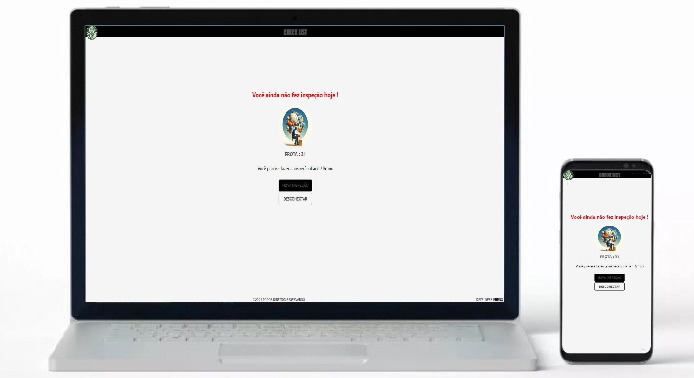
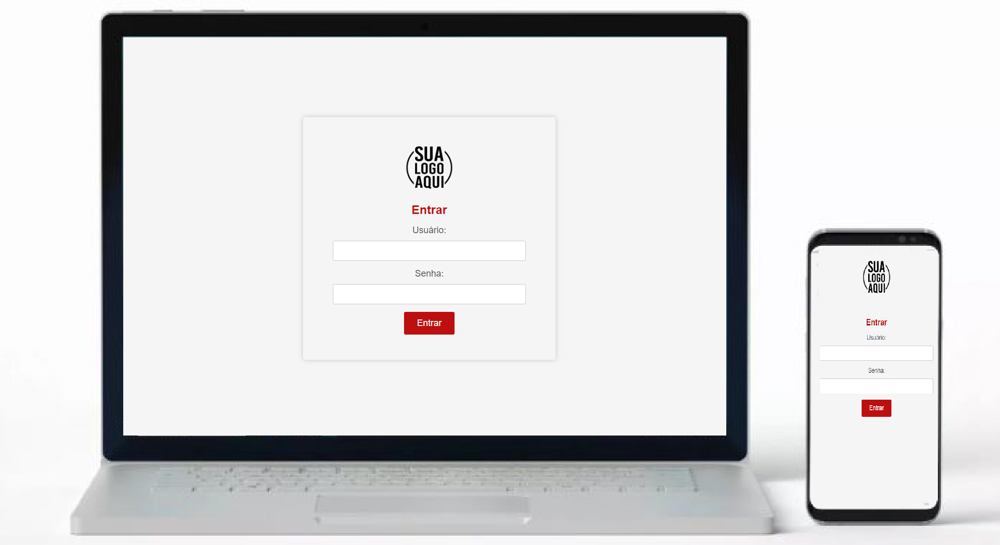
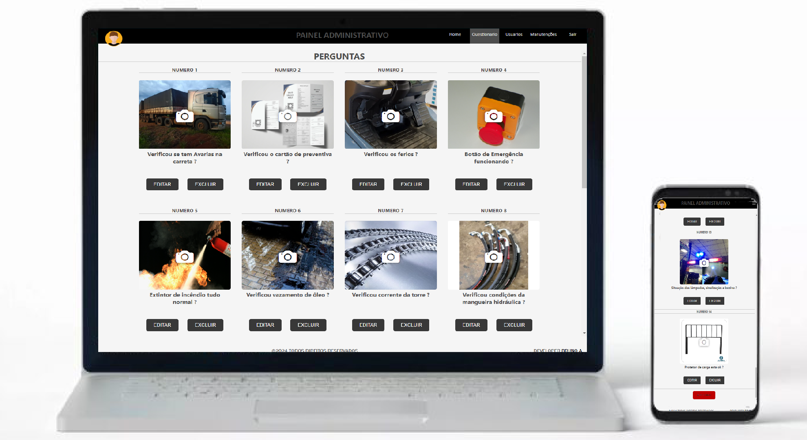

# Checklist

Este é um projeto de checklist desenvolvido com Node.js e Express.

## Visão Geral

Este projeto implementa uma aplicação de checklist onde os usuários podem realizar diversas tarefas de maneira organizada.

## Instalação

1. Clone este repositório em sua máquina local.
2. Instale as dependências usando o comando `npm install`.
3. Renomeie o arquivo `.env.example` para `.env` e configure as variáveis de ambiente conforme necessário.

## Configuração

Este projeto usa variáveis de ambiente para configurar informações sensíveis. Certifique-se de configurar corretamente as variáveis de ambiente no arquivo `.env`.

## Uso

Para iniciar o servidor, use o seguinte comando:

npm start

Depois que o servidor estiver em execução, você pode acessar a aplicação em [http://localhost:3000](http://localhost:3000).

## Capturas de Tela

## Licença

Este projeto está licenciado sob a Licença MIT. Consulte o arquivo [LICENSE](LICENSE) para obter mais detalhes.